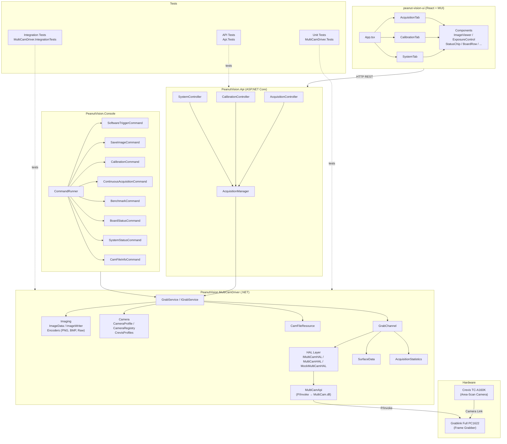
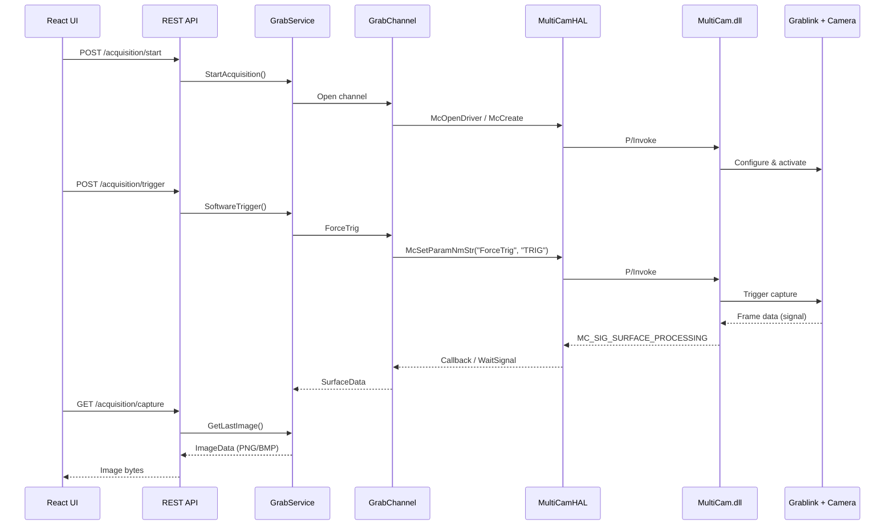

# PeanutVision System Overview

## Architecture Diagram



## Project Structure

```
peanut-factory/
├── src/
│   ├── PeanutVision.MultiCamDriver/     # Core driver library
│   │   ├── Hal/                          # Hardware abstraction layer
│   │   │   ├── IMultiCamHAL.cs           #   HAL interface
│   │   │   ├── MultiCamHAL.cs            #   Real hardware implementation
│   │   │   └── MockMultiCamHAL.cs        #   Mock for testing
│   │   ├── Imaging/                      # Image processing & encoding
│   │   │   ├── ImageData.cs              #   Raw image data model
│   │   │   ├── ImageWriter.cs            #   File output
│   │   │   ├── IImageEncoder.cs          #   Encoder interface
│   │   │   ├── ImageEncoderRegistry.cs   #   Encoder lookup
│   │   │   └── Encoders/                 #   PNG, BMP, Raw encoders
│   │   ├── Camera/                       # Camera profiles
│   │   │   ├── CameraProfile.cs          #   Profile model
│   │   │   ├── CameraRegistry.cs         #   Profile registry
│   │   │   └── Profiles/CrevisProfiles.cs
│   │   ├── MultiCamApi.cs                # P/Invoke bindings to MultiCam.dll
│   │   ├── GrabService.cs                # High-level acquisition service
│   │   ├── IGrabService.cs               # Service interface
│   │   ├── GrabChannel.cs                # Channel lifecycle management
│   │   ├── SurfaceData.cs                # Frame buffer data model
│   │   ├── AcquisitionStatistics.cs      # Performance counters
│   │   ├── CamFileResource.cs            # .cam file management
│   │   ├── ImageSaver.cs                 # Image save helper
│   │   └── ServiceCollectionExtensions.cs # DI registration
│   │
│   ├── PeanutVision.Api/                 # REST API server
│   │   ├── Program.cs
│   │   ├── Services/AcquisitionManager.cs
│   │   └── Controllers/
│   │       ├── AcquisitionController.cs  # Start/stop/trigger/capture
│   │       ├── CalibrationController.cs  # FFC & white balance
│   │       └── SystemController.cs       # Board & camera info
│   │
│   ├── PeanutVision.Console/             # CLI tool
│   │   ├── Program.cs
│   │   ├── CommandRunner.cs
│   │   ├── ICommand.cs
│   │   ├── CommandContext.cs
│   │   └── Commands/
│   │       ├── SoftwareTriggerCommand.cs
│   │       ├── SaveImageCommand.cs
│   │       ├── CalibrationCommand.cs
│   │       ├── ContinuousAcquisitionCommand.cs
│   │       ├── BenchmarkCommand.cs
│   │       ├── BoardStatusCommand.cs
│   │       ├── SystemStatusCommand.cs
│   │       └── CamFileInfoCommand.cs
│   │
│   ├── peanut-vision-ui/                 # React dashboard (Vite + MUI)
│   │   └── src/
│   │       ├── App.tsx
│   │       ├── api/                      # API client & types
│   │       ├── tabs/                     # Acquisition, Calibration, System
│   │       ├── components/               # Shared UI components
│   │       ├── hooks/                    # useApiData, usePolling, ...
│   │       └── theme.ts                  # MUI dark theme
│   │
│   ├── PeanutVision.StrobeLightConsole/  # Strobe light control utility
│   │
│   ├── PeanutVision.MultiCamDriver.Tests/           # Unit tests
│   ├── PeanutVision.MultiCamDriver.IntegrationTests/ # HW integration tests
│   └── PeanutVision.Api.Tests/                      # API spec tests
│
├── doc/                                  # SDK documentation (markdown + PDF)
├── setup/                                # Camera files & SDK headers
│   ├── camfiles/
│   └── multicam_header_files/
└── peanut-factory.sln                    # Solution file
```

## Data Flow



## Technology Stack

| Layer | Technology |
|-------|-----------|
| Hardware | Crevis TC-A160K (Camera Link) + Grablink Full PC1622 |
| Native Driver | MultiCam.dll (Euresys SDK) |
| Core Library | .NET 9/10, C# 12, LibraryImport (P/Invoke) |
| REST API | ASP.NET Core Minimal/Controllers |
| Frontend | React 18, TypeScript, Vite, MUI (Material UI) |
| Testing | xUnit, WebApplicationFactory |
