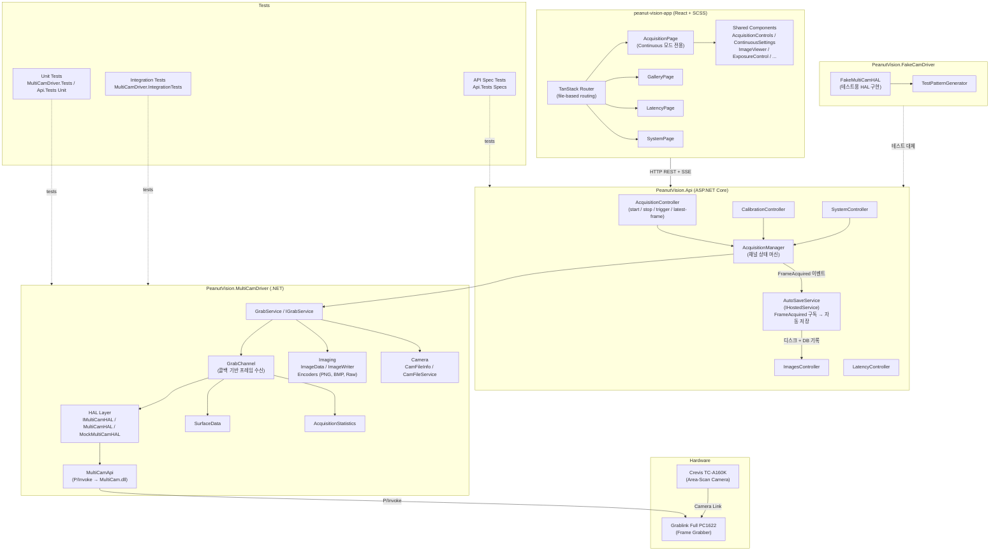
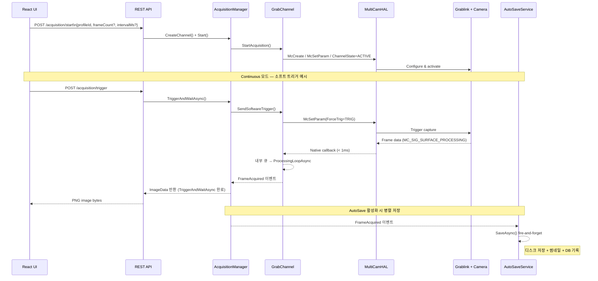

# PeanutVision System Overview

## Architecture Diagram


```mermaid
graph TB
    subgraph HW["Hardware"]
        CAM["Crevis TC-A160K\n(Area-Scan Camera)"]
        GL["Grablink Full PC1622\n(Frame Grabber)"]
        CAM -->|Camera Link| GL
    end

    subgraph Driver["PeanutVision.MultiCamDriver (.NET)"]
        HAL["HAL Layer\nIMultiCamHAL / MultiCamHAL / MockMultiCamHAL"]
        MCAPI["MultiCamApi\n(P/Invoke → MultiCam.dll)"]
        GS["GrabService / IGrabService"]
        GC["GrabChannel\n(콜백 기반 프레임 수신)"]
        IMG["Imaging\nImageData / ImageWriter\nEncoders (PNG, BMP, Raw)"]
        CAMF["Camera\nCamFileInfo / CamFileService"]
        SURF["SurfaceData"]
        STATS["AcquisitionStatistics"]

        GS --> GC
        GC --> HAL
        HAL --> MCAPI
        GC --> SURF
        GC --> STATS
        GS --> IMG
        GS --> CAMF
    end

    subgraph API["PeanutVision.Api (ASP.NET Core)"]
        ACQC["AcquisitionController\n(start / stop / trigger / latest-frame)"]
        CALC["CalibrationController"]
        SYSC["SystemController"]
        IMGC["ImagesController"]
        LATC["LatencyController"]
        ACQM["AcquisitionManager\n(채널 상태 머신)"]
        AUTOSAVE["AutoSaveService\n(IHostedService)\nFrameAcquired 구독 → 자동 저장"]

        ACQC --> ACQM
        CALC --> ACQM
        SYSC --> ACQM
        ACQM --> GS
        ACQM -->|"FrameAcquired 이벤트"| AUTOSAVE
        AUTOSAVE -->|"디스크 + DB 기록"| IMGC
    end

    subgraph FakeCam["PeanutVision.FakeCamDriver"]
        FHAL["FakeMultiCamHAL\n(테스트용 HAL 구현)"]
        FGEN["TestPatternGenerator"]
        FHAL --> FGEN
    end

    subgraph UI["peanut-vision-app (React + SCSS)"]
        ROUTER["TanStack Router\n(file-based routing)"]
        ACQPAGE["AcquisitionPage\n(Continuous 모드 전용)"]
        GALPAGE["GalleryPage"]
        LATPAGE["LatencyPage"]
        SYSPAGE["SystemPage"]
        SHARED["Shared Components\nAcquisitionControls / ContinuousSettings\nImageViewer / ExposureControl / ..."]

        ROUTER --> ACQPAGE
        ROUTER --> GALPAGE
        ROUTER --> LATPAGE
        ROUTER --> SYSPAGE
        ACQPAGE --> SHARED
    end

    subgraph Tests["Tests"]
        UT["Unit Tests\nMultiCamDriver.Tests / Api.Tests Unit"]
        IT["Integration Tests\nMultiCamDriver.IntegrationTests"]
        AT["API Spec Tests\nApi.Tests Specs"]
    end

    MCAPI -->|"P/Invoke"| GL
    UI -->|"HTTP REST + SSE"| API
    FakeCam -.->|"테스트 대체"| API
    UT -.->|tests| Driver
    IT -.->|tests| Driver
    AT -.->|tests| API
```

## Project Structure

```
peanut-factory/
├── src/
│   ├── PeanutVision.MultiCamDriver/          # 코어 드라이버 라이브러리
│   │   ├── Hal/                               # 하드웨어 추상화 레이어
│   │   │   ├── IMultiCamHAL.cs               #   HAL 인터페이스
│   │   │   ├── MultiCamHAL.cs                #   실제 하드웨어 구현
│   │   │   └── MockMultiCamHAL.cs            #   테스트용 Mock
│   │   ├── Imaging/                           # 이미지 처리 및 인코딩
│   │   │   ├── ImageData.cs                  #   원시 이미지 데이터 모델
│   │   │   ├── ImageWriter.cs                #   파일 출력
│   │   │   ├── IImageEncoder.cs              #   인코더 인터페이스
│   │   │   ├── ImageEncoderRegistry.cs       #   인코더 조회
│   │   │   └── Encoders/                     #   PNG, BMP, Raw 인코더
│   │   ├── Camera/                            # CamFile 파싱 및 관리
│   │   │   ├── CamFileInfo.cs                #   .cam 파일 메타데이터
│   │   │   ├── CamFileParser.cs              #   파서
│   │   │   └── CamFileService.cs             #   서비스
│   │   ├── MultiCamApi.cs                    # P/Invoke 바인딩 (MultiCam.dll)
│   │   ├── GrabService.cs                    # 드라이버 초기화 + 채널 관리
│   │   ├── GrabChannel.cs                    # 채널 수명주기 (콜백 전용)
│   │   ├── SurfaceData.cs                    # 프레임 버퍼 데이터 모델
│   │   ├── AcquisitionStatistics.cs          # 성능 카운터
│   │   └── ServiceCollectionExtensions.cs    # DI 등록
│   │
│   ├── PeanutVision.FakeCamDriver/           # 테스트용 가짜 HAL 구현
│   │   ├── FakeMultiCamHAL.cs               #   MockHAL 기반 프레임 시뮬레이터
│   │   ├── FakeHalConfiguration.cs          #   시뮬레이션 설정
│   │   ├── SurfaceMemoryManager.cs          #   가상 서피스 메모리
│   │   └── FrameGenerators/                 #   테스트 패턴 생성기
│   │
│   ├── PeanutVision.Api/                     # REST API 서버
│   │   ├── Program.cs
│   │   ├── Controllers/
│   │   │   ├── AcquisitionController.cs     #   start / stop / trigger / latest-frame
│   │   │   ├── CalibrationController.cs     #   FFC & 화이트 밸런스
│   │   │   ├── SystemController.cs          #   보드 & 카메라 정보
│   │   │   ├── ImagesController.cs          #   저장 이미지 목록/조회/삭제
│   │   │   ├── LatencyController.cs         #   레이턴시 분석
│   │   │   ├── SessionController.cs         #   촬영 세션 관리
│   │   │   ├── SettingsController.cs        #   이미지 저장 설정
│   │   │   └── PresetController.cs          #   촬영 프리셋
│   │   └── Services/
│   │       ├── AcquisitionManager.cs        #   채널 상태 머신 (None→Idle→Active)
│   │       ├── AutoSaveService.cs           #   FrameAcquired 구독 → headless 자동 저장
│   │       ├── CalibrationManager.cs        #   캘리브레이션 조율
│   │       ├── LatencyService.cs            #   레이턴시 측정 및 기록
│   │       ├── ImageSaveSettingsService.cs  #   저장 설정 영속화
│   │       ├── FilenameGenerator.cs         #   파일명 생성 전략
│   │       ├── FrameSaveTracker.cs          #   중복 저장 방지
│   │       ├── ThumbnailService.cs          #   썸네일 생성
│   │       └── SessionRepository.cs        #   세션 DB 레포지토리
│   │
│   ├── peanut-vision-app/                    # React 대시보드 (Vite + TanStack Router + SCSS)
│   │   └── src/
│   │       ├── routes/                       # 파일 기반 라우팅
│   │       ├── components/
│   │       │   ├── Acquisition/             #   촬영 페이지 (Continuous 모드 전용)
│   │       │   ├── Gallery/                 #   이미지 갤러리
│   │       │   ├── Latency/                 #   레이턴시 분석
│   │       │   ├── SystemState/             #   시스템 상태
│   │       │   └── shared/                  #   AcquisitionControls, ContinuousSettings,
│   │       │                                #   ImageViewer, ExposureControl, ...
│   │       ├── hooks/
│   │       │   ├── useAcquisitionActions.ts #   촬영 액션 (Continuous 모드)
│   │       │   └── useLiveStream.ts         #   SSE 기반 라이브 뷰
│   │       └── api/                         #   REST API 클라이언트 & 타입 정의
│   │
│   ├── PeanutVision.MultiCamDriver.Tests/            # 유닛 테스트
│   ├── PeanutVision.MultiCamDriver.IntegrationTests/ # HW 통합 테스트
│   └── PeanutVision.Api.Tests/                       # API 스펙 테스트 (354개)
│
├── doc/                                      # SDK 문서 (마크다운)
├── setup/                                    # 카메라 파일 & SDK 헤더
│   ├── camfiles/
│   └── multicam_header_files/
└── peanut-factory.sln
```

## Acquisition Flow (촬영 흐름)


```mermaid
sequenceDiagram
    participant UI as React UI
    participant API as REST API
    participant ACQM as AcquisitionManager
    participant CH as GrabChannel
    participant HAL as MultiCamHAL
    participant HW as Grablink + Camera
    participant SAVE as AutoSaveService

    UI->>API: POST /acquisition/start\n{profileId, frameCount?, intervalMs?}
    API->>ACQM: CreateChannel() + Start()
    ACQM->>CH: StartAcquisition()
    CH->>HAL: McCreate / McSetParam / ChannelState=ACTIVE
    HAL->>HW: Configure & activate

    Note over UI,SAVE: Continuous 모드 — 소프트 트리거 예시
    UI->>API: POST /acquisition/trigger
    API->>ACQM: TriggerAndWaitAsync()
    ACQM->>CH: SendSoftwareTrigger()
    CH->>HAL: McSetParam(ForceTrig=TRIG)
    HAL->>HW: Trigger capture

    HW-->>HAL: Frame data (MC_SIG_SURFACE_PROCESSING)
    HAL-->>CH: Native callback (< 1ms)
    CH-->>CH: 내부 큐 → ProcessingLoopAsync
    CH-->>ACQM: FrameAcquired 이벤트
    ACQM-->>API: ImageData 반환 (TriggerAndWaitAsync 완료)
    API-->>UI: PNG image bytes

    Note over ACQM,SAVE: AutoSave 활성화 시 병렬 저장
    ACQM-->>SAVE: FrameAcquired 이벤트
    SAVE-->>SAVE: SaveAsync() fire-and-forget
    Note right of SAVE: 디스크 저장 + 썸네일 + DB 기록
```

## Acquisition Mode

촬영은 **Continuous 모드** 하나만 존재합니다.

| 파라미터 | 설명 |
|---------|------|
| `profileId` | 사용할 cam 파일 이름 |
| `triggerMode` | `soft` / `hard` / `combined` |
| `frameCount` | 캡처할 프레임 수 (`null` = 무한, `1` = 단발 촬영) |
| `intervalMs` | 자동 트리거 간격 (auto submode) |

단발 촬영(`frameCount=1`)은 프레임 수신 후 채널이 자동으로 Idle 상태로 돌아갑니다.

## AutoSave 동작

`AutoSaveService`(`IHostedService`)가 `FrameAcquired` 이벤트를 구독하여 AutoSave 설정이 켜져 있으면 HTTP 요청 없이 자동으로 저장합니다.

```
FrameAcquired 이벤트
  → AutoSave 설정 확인
  → FrameSaveTracker (중복 방지)
  → ImageWriter.Save() → 디스크
  → ThumbnailService.GenerateAsync()
  → ICapturedImageRepository.AddAsync() → DB
```

## Technology Stack

| Layer | Technology |
|-------|-----------|
| Hardware | Crevis TC-A160K (Camera Link) + Grablink Full PC1622 |
| Native Driver | MultiCam.dll (Euresys SDK) |
| Core Library | .NET 10, C# 12, LibraryImport (P/Invoke) |
| REST API | ASP.NET Core (Controllers) |
| Background Service | IHostedService (AutoSaveService) |
| Database | SQLite (EF Core) |
| Frontend | React 19, TypeScript, Vite, TanStack Router, SCSS Modules |
| Testing | xUnit, WebApplicationFactory, 354 tests |
