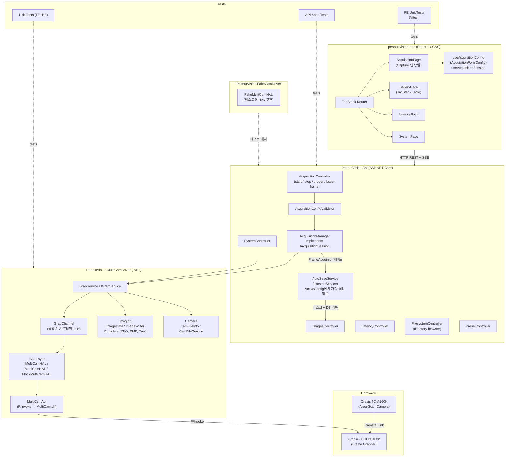
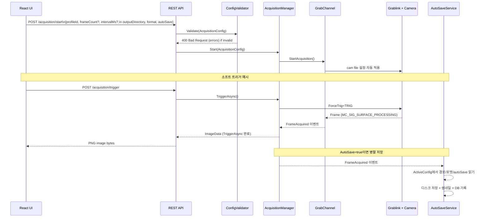

# PeanutVision System Overview

## Architecture Diagram


```mermaid
graph TB
    subgraph HW["Hardware"]
        CAM["Crevis TC-A160K\n(Area-Scan Camera)"]
        GL["Grablink Full PC1622\n(Frame Grabber)"]
        CAM -->|Camera Link| GL
    end

    subgraph Driver["PeanutVision.MultiCamDriver (.NET)"]
        HAL["HAL Layer\nIMultiCamHAL / MultiCamHAL / MockMultiCamHAL"]
        MCAPI["MultiCamApi\n(P/Invoke → MultiCam.dll)"]
        GS["GrabService / IGrabService"]
        GC["GrabChannel\n(콜백 기반 프레임 수신)"]
        IMG["Imaging\nImageData / ImageWriter\nEncoders (PNG, BMP, Raw)"]
        CAMF["Camera\nCamFileInfo / CamFileService"]

        GS --> GC
        GC --> HAL
        HAL --> MCAPI
        GS --> IMG
        GS --> CAMF
    end

    subgraph API["PeanutVision.Api (ASP.NET Core)"]
        ACQC["AcquisitionController\n(start / stop / trigger / latest-frame)"]
        SYSC["SystemController"]
        IMGC["ImagesController"]
        LATC["LatencyController"]
        FSC["FilesystemController\n(directory browser)"]
        PRSTC["PresetController"]
        ACQM["AcquisitionManager\nimplements IAcquisitionSession"]
        VALID["AcquisitionConfigValidator"]
        AUTOSAVE["AutoSaveService\n(IHostedService)\nActiveConfig에서 저장 설정 읽음"]

        ACQC --> VALID
        VALID --> ACQM
        SYSC --> GS
        ACQM --> GS
        ACQM -->|"FrameAcquired 이벤트"| AUTOSAVE
        AUTOSAVE -->|"디스크 + DB 기록"| IMGC
    end

    subgraph FakeCam["PeanutVision.FakeCamDriver"]
        FHAL["FakeMultiCamHAL\n(테스트용 HAL 구현)"]
    end

    subgraph UI["peanut-vision-app (React + SCSS)"]
        ROUTER["TanStack Router"]
        ACQPAGE["AcquisitionPage\n(Capture 탭 단일)"]
        GALPAGE["GalleryPage\n(TanStack Table)"]
        LATPAGE["LatencyPage"]
        SYSPAGE["SystemPage"]
        HOOKS["useAcquisitionConfig\n(AcquisitionFormConfig)\nuseAcquisitionSession"]

        ROUTER --> ACQPAGE
        ROUTER --> GALPAGE
        ROUTER --> LATPAGE
        ROUTER --> SYSPAGE
        ACQPAGE --> HOOKS
    end

    subgraph Tests["Tests"]
        UT["Unit Tests (FE+BE)"]
        AT["API Spec Tests"]
        FET["FE Unit Tests\n(Vitest)"]
    end

    MCAPI -->|"P/Invoke"| GL
    UI -->|"HTTP REST + SSE"| API
    FakeCam -.->|"테스트 대체"| API
    UT -.->|tests| Driver
    AT -.->|tests| API
    FET -.->|tests| UI
```

## Project Structure

```
peanut-factory/
├── src/
│   ├── PeanutVision.MultiCamDriver/          # 코어 드라이버 라이브러리
│   │   ├── Hal/                               # 하드웨어 추상화 레이어
│   │   ├── Imaging/                           # 이미지 처리 및 인코딩 (PNG, BMP, Raw)
│   │   ├── Camera/                            # CamFile 파싱 및 관리
│   │   ├── MultiCamApi.cs                    # P/Invoke 바인딩 (MultiCam.dll)
│   │   ├── GrabService.cs                    # 드라이버 초기화 + 채널 관리
│   │   ├── GrabChannel.cs                    # 채널 수명주기 (콜백 전용)
│   │   └── AcquisitionStatistics.cs          # 성능 카운터
│   │
│   ├── PeanutVision.FakeCamDriver/           # 테스트용 가짜 HAL 구현
│   │
│   ├── PeanutVision.Api/                     # REST API 서버
│   │   ├── Controllers/
│   │   │   ├── AcquisitionController.cs     #   start / stop / trigger / latest-frame
│   │   │   ├── FilesystemController.cs      #   서버 파일시스템 탐색 (디렉토리 브라우저)
│   │   │   ├── SystemController.cs          #   보드 & 카메라 정보
│   │   │   ├── ImagesController.cs          #   저장 이미지 목록/조회/삭제
│   │   │   ├── LatencyController.cs         #   레이턴시 분석
│   │   │   └── PresetController.cs          #   촬영 프리셋 CRUD
│   │   └── Services/
│   │       ├── IAcquisitionSession.cs       #   촬영 세션 인터페이스 (7 members)
│   │       ├── AcquisitionManager.cs        #   상태 머신 (None→Idle→Active)
│   │       ├── AcquisitionConfig.cs         #   촬영+저장 통합 값 객체
│   │       │                                #   (ProfileId, FrameCount, IntervalMs,
│   │       │                                #    OutputDirectory, Format, AutoSave)
│   │       ├── AcquisitionStatus.cs         #   촬영 상태 스냅샷
│   │       ├── AcquisitionConfigPreset.cs   #   AcquisitionConfig의 영속 템플릿
│   │       ├── AcquisitionConfigValidator.cs #  입력 유효성 검사 (400 반환)
│   │       ├── AutoSaveService.cs           #   FrameAcquired → 자동 저장
│   │       ├── FilenameGenerator.cs         #   {date}/{profile} 토큰 기반 경로
│   │       ├── FrameSaveTracker.cs          #   중복 저장 방지
│   │       ├── LatencyService.cs            #   레이턴시 측정
│   │       └── ThumbnailService.cs          #   썸네일 생성
│   │
│   ├── peanut-vision-app/                    # React 대시보드 (Vite + TanStack Router + SCSS)
│   │   └── src/
│   │       ├── components/
│   │       │   ├── Acquisition/             #   촬영 페이지 (Capture 탭 단일)
│   │       │   │   ├── index.tsx            #     레이아웃 (탭 없음, 단순 레이아웃)
│   │       │   │   └── CaptureTab.tsx       #     Active readonly뷰 / Manual폼 / Preset폼
│   │       │   ├── Gallery/                 #   이미지 갤러리 (TanStack Table, 날짜 필터)
│   │       │   ├── Latency/                 #   레이턴시 분석 차트
│   │       │   ├── SystemState/             #   시스템 상태
│   │       │   └── shared/
│   │       │       ├── AcquisitionSettings/ #   촬영+저장 통합 설정 폼 (2개 카드)
│   │       │       ├── AcquisitionActionBar/#   Start/Stop/Trigger 버튼
│   │       │       ├── DirectoryBrowser/    #   서버 파일시스템 탐색 모달
│   │       │       ├── ImageGallery/        #   TanStack Table 기반 이미지 목록
│   │       │       └── ImageViewer/         #   이미지 미리보기
│   │       ├── hooks/
│   │       │   ├── useAcquisitionConfig.ts  #   AcquisitionFormConfig 단일 상태 관리
│   │       │   ├── useAcquisitionSession.ts #   start/stop/trigger + 서버 상태
│   │       │   ├── useImageGallery.ts       #   이미지 선택 상태
│   │       │   └── useLiveStream.ts         #   SSE 기반 라이브 뷰
│   │       ├── api/
│   │       │   ├── types.ts                 #   AcquisitionFormConfig, AcquisitionConfigPreset, ...
│   │       │   └── client.ts                #   REST API 클라이언트
│   │       └── test/                        #   Vitest + React Testing Library
│   │
│   ├── PeanutVision.MultiCamDriver.Tests/
│   ├── PeanutVision.MultiCamDriver.IntegrationTests/
│   └── PeanutVision.Api.Tests/
│
├── doc/
├── setup/
└── peanut-factory.sln
```

## Acquisition Flow (촬영 흐름)


```mermaid
sequenceDiagram
    participant UI as React UI
    participant API as REST API
    participant VAL as ConfigValidator
    participant ACQM as AcquisitionManager
    participant CH as GrabChannel
    participant HW as Grablink + Camera
    participant SAVE as AutoSaveService

    UI->>API: POST /acquisition/start\n{profileId, frameCount?, intervalMs?,\n outputDirectory, format, autoSave}
    API->>VAL: Validate(AcquisitionConfig)
    VAL-->>API: 400 Bad Request (errors) if invalid
    API->>ACQM: Start(AcquisitionConfig)
    ACQM->>CH: StartAcquisition()
    CH->>HW: cam file 설정 자동 적용

    Note over UI,SAVE: 소프트 트리거 예시
    UI->>API: POST /acquisition/trigger
    API->>ACQM: TriggerAsync()
    ACQM->>HW: ForceTrig=TRIG

    HW-->>CH: Frame (MC_SIG_SURFACE_PROCESSING)
    CH-->>ACQM: FrameAcquired 이벤트
    ACQM-->>API: ImageData (TriggerAsync 완료)
    API-->>UI: PNG image bytes

    Note over ACQM,SAVE: AutoSave=true이면 병렬 저장
    ACQM-->>SAVE: FrameAcquired 이벤트
    SAVE-->>SAVE: ActiveConfig에서 경로/포맷/autoSave 읽기
    SAVE-->>SAVE: 디스크 저장 + 썸네일 + DB 기록
```

## AcquisitionConfig — 촬영+저장 통합 설정

`AcquisitionConfig`는 촬영 파라미터와 저장 설정을 하나의 값 객체로 통합합니다. 별도의 `ImageSaveSettings`는 존재하지 않습니다.

```csharp
public sealed record AcquisitionConfig(
    ProfileId ProfileId,
    int? FrameCount = null,       // null = 무한
    int? IntervalMs = null,       // null = 수동 트리거, ≥50ms
    string OutputDirectory = "CapturedImages",  // {date}, {profile} 토큰 지원
    SaveImageFormat Format = SaveImageFormat.Png,
    bool AutoSave = true
);
```

`AcquisitionConfigPreset`은 이 설정 전체를 이름과 함께 영속화합니다.

**서버사이드 유효성 검사 (`AcquisitionConfigValidator`):**
- `profileId`: 필수, cam 파일 레지스트리에 존재해야 함
- `intervalMs`: null이거나 ≥ 50ms (0 거부)
- `frameCount`: null이거나 > 0
- `outputDirectory`: 비어있지 않음
- `format`: 유효한 enum 값 (png/bmp/raw)
- 실패 시 400 + `{ errors: [{field, message}] }` 배열 반환

## Acquisition Mode

촬영은 **Continuous 모드** 하나만 존재합니다.

| 파라미터 | 설명 |
|---------|------|
| `profileId` | 사용할 cam 파일 이름 (트리거 방식 포함) |
| `frameCount` | 캡처할 프레임 수 (`null` = 무한) |
| `intervalMs` | 자동 트리거 간격, null = 수동 (UI 입력은 초 단위) |
| `outputDirectory` | 저장 경로 (`{date}`, `{profile}` 토큰 지원) |
| `format` | `png` / `bmp` / `raw` |
| `autoSave` | 프레임 수신 시 자동 저장 여부 |

**FE 입력 단위:** Interval은 UI에서 **초(s)** 단위로 입력. 내부 및 서버 통신은 ms.

**트리거 방식:**
- `IntervalMs` 있음 → 자동(주기적) 트리거
- `IntervalMs` null → 수동 (Trigger 버튼 클릭)

## Camera Profile (.cam 파일) 설계 원칙

캘리브레이션(FFC, 화이트 밸런스, 노출)은 서비스 UI에서 제거되었습니다.  
**cam 파일이 이미 보정된 설정을 포함**한다고 가정합니다.

트리거 방식(soft/hard/combined)도 cam 파일에 내장되므로 API에 별도로 전달하지 않습니다.

**재캘리브레이션이 필요한 경우:** MultiCam Studio 또는 별도 CLI 툴 사용.

## FE 상태 관리 — AcquisitionFormConfig

FE의 모든 촬영+저장 설정은 하나의 typed 객체로 관리됩니다.

```typescript
interface AcquisitionFormConfig {
  profileId: string
  acquisitionMode: 'auto' | 'manual'  // FE-only, intervalMs로 파생
  frameCount: number | null
  intervalMs: number | null            // ms 단위 (입력은 s 단위)
  outputDirectory: string
  format: SaveImageFormat
  autoSave: boolean
}
```

`useAcquisitionConfig` 훅이 단일 `useState<AcquisitionFormConfig>`와 generic 업데이터 `updateConfig<K>(key, value)`를 제공합니다.

## AutoSave 동작

`AutoSaveService`가 `FrameAcquired` 이벤트를 구독해, ActiveConfig의 설정에 따라 자동 저장합니다.

```
FrameAcquired 이벤트
  → GetStatus().ActiveConfig?.AutoSave 확인
  → FrameSaveTracker (중복 방지)
  → FilenameGenerator.Generate(config) → 경로 생성 ({date}/{profile} 토큰)
  → ImageWriter.Save() → 디스크
  → ThumbnailService.GenerateAsync()
  → ICapturedImageRepository.AddAsync() → DB
```

## Gallery

TanStack Table 기반 테이블 뷰로 메타데이터 표시. 날짜 범위 필터는 TanStack Table `columnFilters` 상태로 관리되며 서버 API에 전달됩니다 (`manualFiltering: true`).

- 행 클릭 → 좌측 ImageViewer 업데이트
- 체크박스 선택 → 일괄 삭제
- 컬럼 정렬 (capturedAt 기본 내림차순)

## Filesystem Browser

저장 경로 설정 시 서버 파일시스템을 브라우저에서 탐색할 수 있습니다.

- `GET /api/filesystem/roots` — 드라이브 루트
- `GET /api/filesystem/list?path=...` — 하위 디렉토리 목록
- DirectoryBrowser 모달: 트리 탐색 → 선택 → `outputDirectory` 자동 입력

## Technology Stack

| Layer | Technology |
|-------|-----------|
| Hardware | Crevis TC-A160K (Camera Link) + Grablink Full PC1622 |
| Native Driver | MultiCam.dll (Euresys SDK) |
| Core Library | .NET 10, C# 12, LibraryImport (P/Invoke) |
| REST API | ASP.NET Core (Controllers) |
| Background Service | IHostedService (AutoSaveService) |
| Database | SQLite (EF Core) |
| Frontend | React 19, TypeScript, Vite, TanStack Router + Table, SCSS Modules |
| FE Testing | Vitest + React Testing Library |
| BE Testing | xUnit, WebApplicationFactory |
